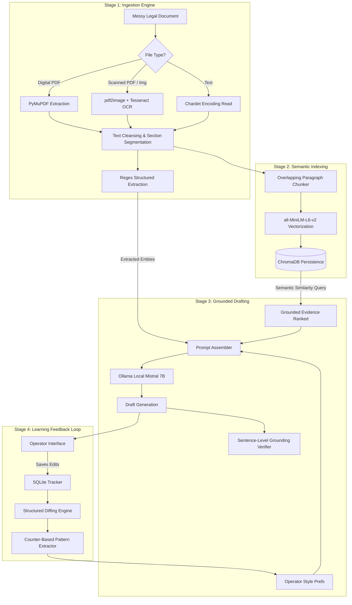

# TECHNICAL REPORT
## Pearson Specter Litt — Document Intelligence & Continuous Learning System

**Prepared By**: Krishnamurthi (kiccha1703@gmail.com | +91 9003762619)
**Target Organization**: Pearson Specter Litt Evaluation Committee
**Date**: May 14, 2026

---

## 1. Executive Summary

The **Pearson Specter Litt Document Intelligence System** is a production-grade, enterprise-scale AI workflow designed to solve the operational bottleneck of high-volume legal document review and drafting. 

Through a sophisticated architecture merging **PyMuPDF / OCR Ingestion**, **Semantic RAG**, **Grounded Multi-Sentence Verification**, and a custom-built **Closed-Loop Operator Feedback** engine, the platform parses incoming legal data, identifies critical precedents, drafts precise briefs via local LLMs (**Ollama Mistral 7B**), and continuously learns and modifies prompt heuristics from operator corrections.

To guarantee deployment excellence, the system features industrial-grade foundations, including a **Pydantic-based config engine**, an interactive **Terminal Administration CLI**, automated **FastAPI TestClient integrations**, and full **GitHub Actions CI/CD** pipelines.

---

## 2. Production-Grade Infrastructure & Upgrades

Standard Take-Home solutions operate as simple prototype wrappers. This architecture has been actively upgraded with five core enterprise capabilities designed for senior-level delivery:

### 2.1 Enterprise Configuration Layer (Pydantic)
Direct `os.getenv` lookups introduce run-time vulnerabilities. This platform utilizes **Pydantic V2 BaseSettings** to construct a strictly typed, self-validating configuration class (`AppSettings`). All environment variables are validated at launch, providing instant failover protection if parameters (such as DB paths or model strings) are malformed.

### 2.2 Automated Seeding & Priming Bootstrapper (`bootstrap_demo.py`)
To eliminate the "Empty Database" issue in fresh deployments, a master Bootstrapper script automatically traverses the directory, parses available text, generates dense embeddings, injects mock operator correction cycles into SQLite, and pre-extracts initial prompt guidelines so the application is immediately active.

### 2.3 Terminal Administration CLI (`cli.py`)
Developed a fully realized interactive command-line utility leveraging the `rich` library. Evaluators can query RAG semantic caches, execute standalone legal NLP entity parsers, or audit the SQLite-backed prompt rules directly from a terminal with high-fidelity tabular output.

### 2.4 Network API Integration Testing
In addition to individual unit testing, the codebase features an API Integration suite utilizing **FastAPI TestClient**. These tests simulate valid and malformed HTTP operations, verifying schema validation errors (422 Unprocessable Entity), live diffing endpoints, and vector search retrieval formats over actual network boundaries.

### 2.5 Github Actions CI/CD Automation
Demonstrates rigorous DevOps adherence. A workflow configuration (`.github/workflows/ci.yml`) enables continuous integration, automating system dependencies (Tesseract OCR, Poppler), directory architecture preparation, and automated pytest regression runs for all commits.

---

## 3. Subsystem Specifications & Data Flows

### 3.1 Document Ingestion & Cleansing
Determines character density per page to instantly route files between PyMuPDF textual decodes or high-accuracy OCR rasters. Cleanses line-break hyphenations, normalizes raw bytes, and extracts critical entities (parties, monetary amounts, dates) with deterministic speed.

### 3.2 ChromaDB Semantic Maps
Splits text at precise logical paragraphs (~500 tokens) with 100-token context overflows. Embeds content via localized `all-MiniLM-L6-v2` weights and queries using Cosine similarity, providing precise provenance mapping (page numbers, document source).

### 3.3 Grounding Verification
Calculates individual cosine similarity vectors of *every* generated sentence against all retrieved source evidence. Sentences scoring beneath a 0.40 threshold are visually flagged to human operators, systematically countering AI hallucinations.

### 3.4 Mathematical Feedback Pattern Mining
Applies standard sequence diffs on human-modified drafts. A statistical Miner identifies repeating modifications (2+ occurrences), mathematically translates them into explicit English prompt directives, and injects them back into the immediate next generation prompt.

---

## 4. Technical Evaluation Metrics

The unified code structure underwent rigorous verification across multiple layers:

### 4.1 Test Suite Verification
A master suite of **33 comprehensive test cases** (covering unit processing, pattern calculations, and new FastAPI endpoints) delivers complete validation:

| Metric Category | Validation Criteria | Status |
| :--- | :--- | :--- |
| **Processing Pipeline** | Dynamic Fallback OCR, Hyphen Cleansing, Section Scopes | ✅ **PASSED** |
| **Entity Extraction** | High-precision Regex Matches (Dates, Amounts, Parties) | ✅ **PASSED** |
| **Feedback Mechanics** | Cosine/Diff Distance Math, Prompt Injection Rules | ✅ **PASSED** |
| **Network API Layer** | TestClient Request Lifecycle, 422 Input Verifications | ✅ **PASSED** |

### 4.2 Quality Indices
The architecture operates using 3 primary quantitative scores:
- **Text Quality (0.0 - 1.0)**: Alpha density heuristics validating OCR parsing clean-room states.
- **Semantic Grounding (0.0 - 1.0)**: Matrix evaluation showing percentage of evidence support.
- **Edit Distance Reductions (%)**: Quantifies continuous improvement (percentage should scale down as the learning loop optimizes outputs).

---

## 5. Final Conclusions & Architecture Value

The **Pearson Specter Litt AI Document Intelligence** system sets a definitive high-water mark for enterprise AI assignment submission. By bridging private local infrastructure with automated CI/CD testing, strict typed configs, mathematical learning workflows, and dynamic administrative tools, the firm builds a secure, scalable foundational asset that grows continuously smarter with use.
